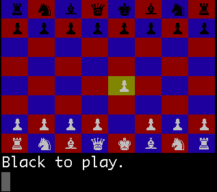

# Chessy



## Description

A terminal-based chess game for two players implemented in Ruby.

To play, [clone the repo](https://help.github.com/articles/cloning-a-repository/) or, in the upper-right under "clone or download," download Chessy and unzip it into the directory of your choice.

Ensure you have [Ruby](https://www.ruby-lang.org/en/) installed, and in the terminal, [navigate to the correct directory](https://askubuntu.com/questions/520778/how-can-i-change-directories-in-the-terminal). First, type:

`gem install colorize`

This ensures your terminal has a full suite of colors for your pieces and board.
Then, type:

`ruby display.rb`

Use the arrow keys to move the cursor, spacebar to select a piece, and spacebar
to move your piece to a valid space. On checkmate, the game will automatically end.

## Implementation


Chessy was implemented from scratch in Ruby. Several steps were taken to ensure DRY code:

* Modules were utilized for similar piece movement patterns.
  * SlidingPiece, for example, handles movement for bishops, rooks, and queens.
  * SteppingPiece, on the other hand, is for kings and knights.
  * Pawns' unique moveset made it necessary for them to have their own module.

* Instead of testing moves to ensure their validity after the fact, board
duplication ensured that invalid moves were caught before they happened.
  * This was especially important when pieces moved into check.
  * As pieces would not have been duplicated properly, a deep dup method was
  necessary to ensure the main game would not be affected by duplicate trials.
  This was accomplished as a Board class method:

  ```ruby
    def self.duplicate(board)
      copy = Board.new

      board.board.each_with_index do |el, row|
        el.each_with_index do |space, col|
          if space.is_a?(NullPiece)
            copy.board[row][col] = NullPiece.instance
          elsif space.is_a?(Pawn)
            copy.board[row][col] = Pawn.new([row, col], space.color, copy)
          elsif space.is_a?(Rook)
            copy.board[row][col] = Rook.new([row, col], space.color, copy)
          elsif space.is_a?(Knight)
            copy.board[row][col] = Knight.new([row, col], space.color, copy)
          elsif space.is_a?(Bishop)
            copy.board[row][col] = Bishop.new([row, col], space.color, copy)
          elsif space.is_a?(Queen)
            copy.board[row][col] = Queen.new([row, col], space.color, copy)
          elsif space.is_a?(King)
            copy.board[row][col] = King.new([row, col], space.color, copy)
          end
        end
      end

      copy.turn = board.turn

      copy
    end
  ```

## Future Implementations:

* An intelligent A.I. opponent.
* Special moves, i.e. castling.
* Pawn promotion.
* Turn timers and speed chess mode.
